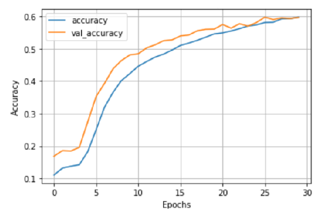
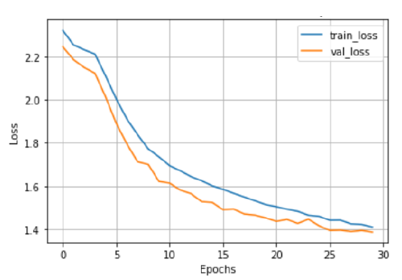
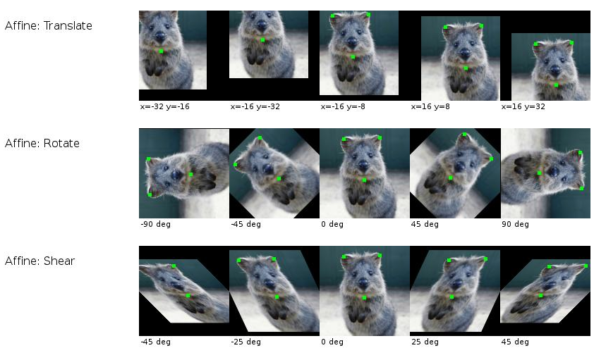

# STL10

* Performed different learning procedures on the STL10 dataset - supervised learning, semi-supervised learning and self-supervised learning

## Supervised Learning 
* Used ResNet-50 Architecture and got validation accuracy of 68.7

## Semi-Supervised Learning 
* Used Pseudo-Labeling method using the same encoder architecture as in supervised learning 

| Model         | Supervised Validation Accuracy         | Semi-Supervised Validation Accuracy   |  Change in Accuracy  |
| ------------- |:-------------:| -----:|                     ------:                                                                       |
| CNN Model     | 59.4          | 64.62 |  5.08                                                                         |
| ResNet-50 Model| 68.73        |   72  |  3.27                                                                         | 

## Self-Supervised Learning 

* For this I used the SimClr framework for contrastive learning and get a valiation accuracy of 53.30%

## AutoAugment 
* I tried to implement semi-supervised tasks using SimClr and augment images using AutoAugment method. The operations we will be using are shearing, translating, rotation,
auto_contrasting, brightness, sharpness, cutout, etc., and the policies for each augmentation are selected randomly and applied in our dataset for producing image augmentations

